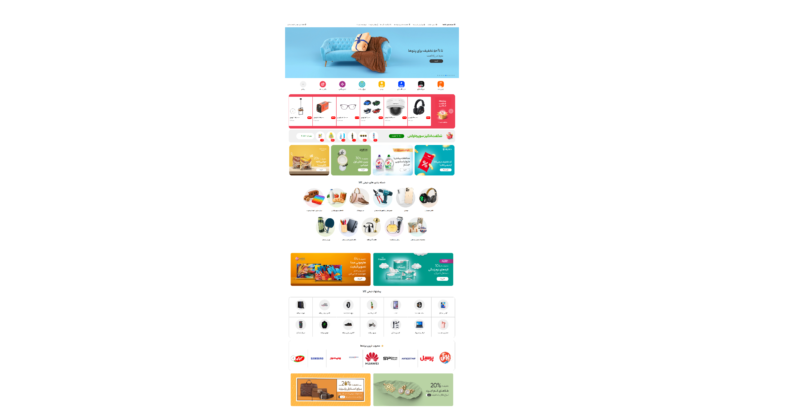

# Digikala Homepage Clone



A front-end clone of the Digikala homepage built for practicing HTML, CSS, and JavaScript.

---

## 🔗 Live Demo

🚧 Coming Soon...

---

## 📖 About The Project

This project is a clone of the Digikala homepage created to improve front-end development skills.

The main goal of this project was to practice:

- HTML5
- CSS3
- JavaScript
- Swiper.js
- Website Layout Design

---

## ✨ Features

- Homepage UI
- Navigation Bar
- Mega Menu
- Slider
- Product Sections
- Footer
- Persian Font Support
- Font Awesome Icons

---

## 🛠 Built With

- HTML5
- CSS3
- JavaScript
- Swiper.js
- Font Awesome

---

## 📁 Project Structure

```text
digikala-homepage-clone
│
├── css/
├── font/
├── icon/
├── screenshots/
├── index.html
├── main.js
├── lastswiper.js
├── package.json
└── README.md
```

---

## 🚀 Future Improvements

- Responsive Design
- Better Accessibility
- Performance Optimization
- Cleaner Folder Structure

---

## 👩‍💻 Author

**Faeze Babaei**

GitHub:
https://github.com/FaezeBababei